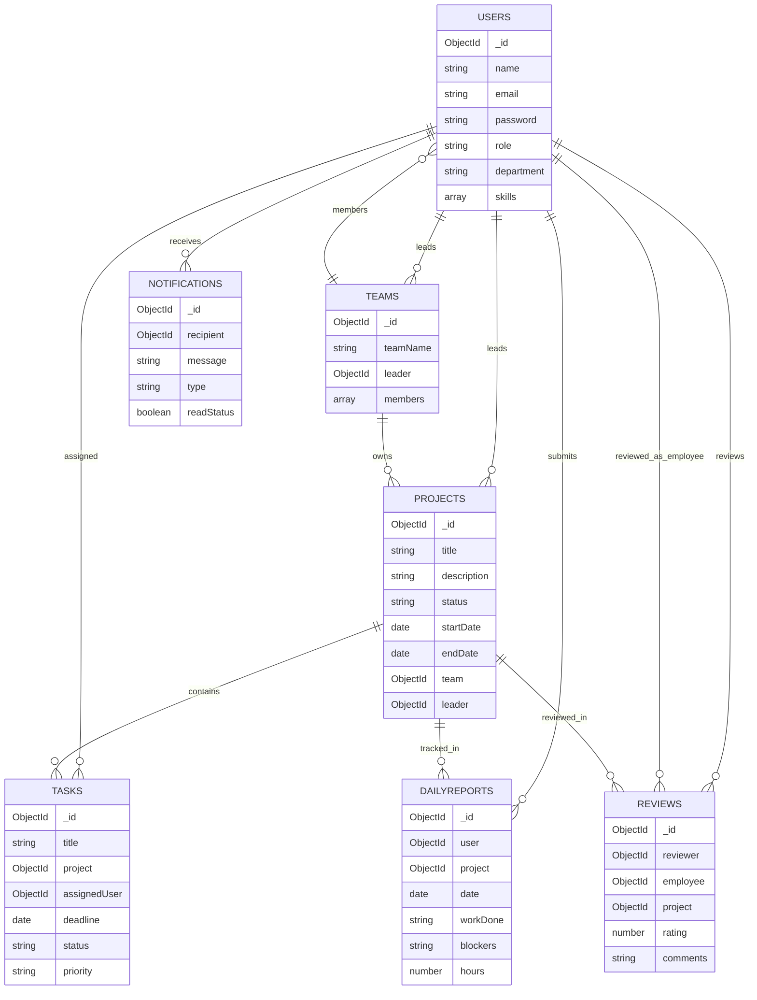

# NexOra — ER Diagram

```mermaid
erDiagram
    USERS ||--o{ TEAMS : leads
    USERS ||--o{ PROJECTS : leads
    USERS ||--o{ TASKS : assigned
    USERS ||--o{ DAILYREPORTS : submits
    USERS ||--o{ REVIEWS : reviews
    USERS ||--o{ REVIEWS : reviewed_as_employee
    USERS ||--o{ NOTIFICATIONS : receives
    TEAMS ||--o{ USERS : members
    TEAMS ||--o{ PROJECTS : owns
    PROJECTS ||--o{ TASKS : contains
    PROJECTS ||--o{ DAILYREPORTS : tracked_in
    PROJECTS ||--o{ REVIEWS : reviewed_in

    USERS {
        ObjectId _id
        string name
        string email
        string password
        string role
        string department
        array skills
    }

    TEAMS {
        ObjectId _id
        string teamName
        ObjectId leader
        array members
    }

    PROJECTS {
        ObjectId _id
        string title
        string description
        string status
        date startDate
        date endDate
        ObjectId team
        ObjectId leader
    }

    TASKS {
        ObjectId _id
        string title
        ObjectId project
        ObjectId assignedUser
        date deadline
        string status
        string priority
    }

    DAILYREPORTS {
        ObjectId _id
        ObjectId user
        ObjectId project
        date date
        string workDone
        string blockers
        number hours
    }

    REVIEWS {
        ObjectId _id
        ObjectId reviewer
        ObjectId employee
        ObjectId project
        number rating
        string comments
    }

    NOTIFICATIONS {
        ObjectId _id
        ObjectId recipient
        string message
        string type
        boolean readStatus
    }
```

This renders automatically in GitHub, VS Code (with a Mermaid preview extension), or any Markdown viewer that supports Mermaid.
